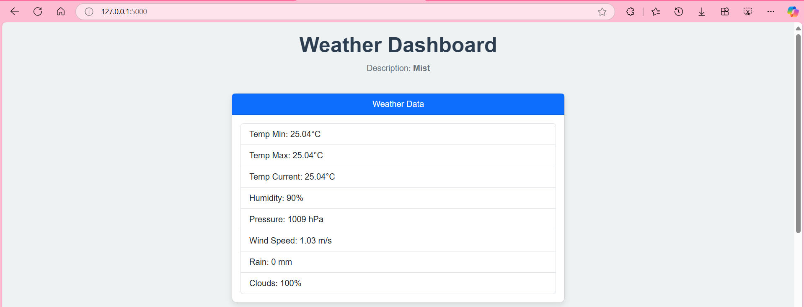
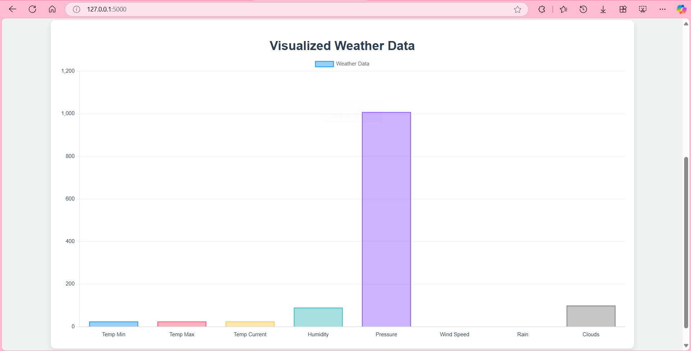

# Weather Dashboard 🌦️

A real-time weather dashboard that fetches and visualizes weather data using the OpenWeather API.

## Features
- Displays current weather data:
  - Temperature (min, max, current, average)
  - Humidity
  - Pressure
  - Wind speed
  - Rainfall
  - Cloud cover
- Interactive bar chart and line chart visualizations.
- Styled using modern design with Bootstrap.

## Screenshots

### Dashboard Overview


### Weather Data Visualization


## Installation

1. Clone the repository:
   ```bash
   git clone https://github.com/ThinhPhan0108/weather-dashboard.git
   cd weather-dashboard
